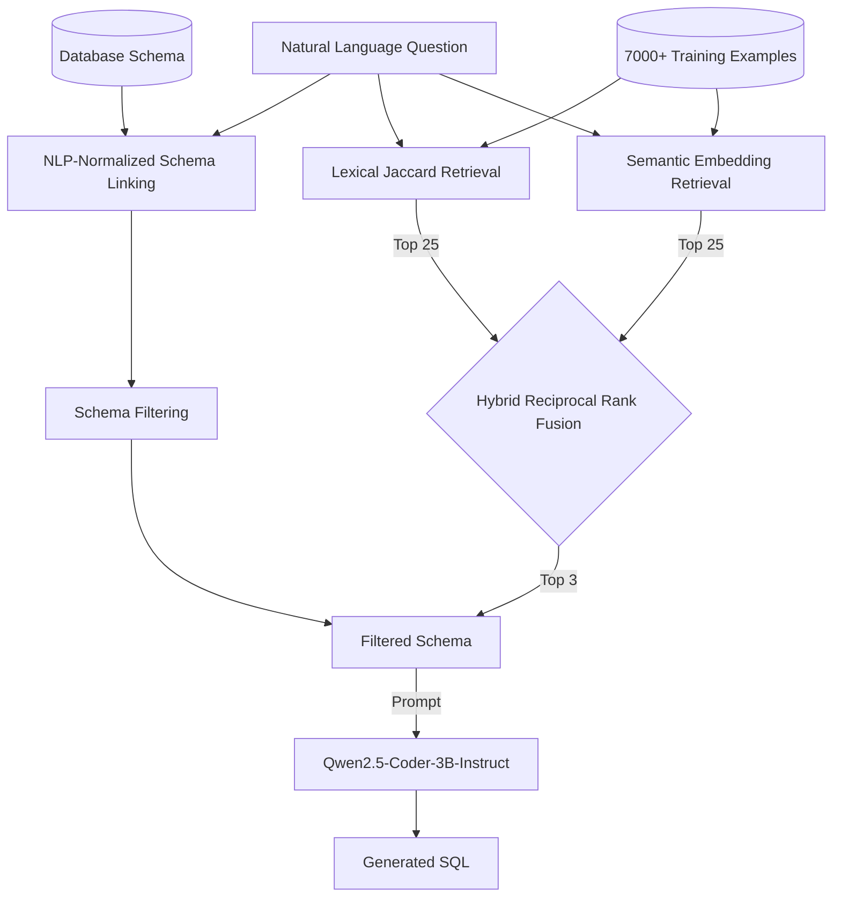

# ModelBench

ModelBench is a specialized evaluation and experimentation platform designed to investigate and optimize few-shot retrieval and schema linking strategies for Local LLM Text-to-SQL generation.

## The Problem
Generating SQL from natural language is notoriously difficult for small, local language models (like the 3B parameter `Qwen2.5-Coder-3B-Instruct`). They frequently suffer from schema hallucination, get confused by large database schemas, and struggle to generalize without highly relevant few-shot examples. 

ModelBench exists to answer the question: **How can we maximize Text-to-SQL performance on small, locally-hosted LLMs through advanced retrieval and schema normalization?**

## Architecture

ModelBench uses a multi-stage pipeline designed to strip away irrelevant noise and provide the LLM with the most pristine, relevant context possible.



## Experimental Results
Through systematic experimentation on the official 1,034-sample Spider dev split, we evaluated several strategies. The central finding of V1 is that **hybrid retrieval using Reciprocal Rank Fusion (M7-RRF) vastly outperforms independent lexical or semantic retrieval.**

| Strategy | Execution Accuracy | SQL Validity | Exact Match |
|:---|---:|---:|---:|
| **Zero-Shot** (NLP-Normalized Schema Linking) `[M4-B.1]` | 42.50% | 83.50% | 12.10% |
| **Lexical** (Jaccard) `[M5]` | 55.13% | 84.04% | 27.85% |
| **Semantic** (BGE Embeddings) `[M6]` | 55.90% | 84.04% | 27.47% |
| **Hybrid RRF** (Lexical + Semantic) `[M7-RRF]` | **58.03%** | **85.88%** | **29.50%** |

*Note: On the evaluated Spider dev split, optimizing the RRF candidate pool to just `N=25` produced exactly the same top-3 retrieval results as exhaustive full-corpus RRF, effectively eliminating retrieval latency while preserving the 58.03% ground-truth accuracy.*

## Getting Started

### Installation
1. Clone the repository and navigate into it.
2. Create and activate a conda environment:
   ```bash
   conda create -n modelbench python=3.11
   conda activate modelbench
   ```
3. Install the package and its dependencies:
   ```bash
   pip install -e '.[all]'
   ```

### Dataset Setup
ModelBench relies on the official Spider dataset for Text-to-SQL evaluation. For our experiments, we used the dataset mirror available on Kaggle.
1. Download the Spider dataset from [Kaggle](https://www.kaggle.com/datasets/jeromeblanchet/yale-universitys-spider-10-nlp-dataset) (or the [official website](https://yale-lily.github.io/spider)).
2. Extract the downloaded archive.
3. Place the contents into the `datasets/spider/` directory in this project. 
   
Your structure should look like this:
```text
datasets/spider/
├── train_spider.json
├── dev.json
├── tables.json
└── database/
    ├── concert_singer/
    │   └── concert_singer.sqlite
    └── ...
```

### Running an Experiment
To run the final, optimized V1 pipeline (Hybrid RRF Retrieval + NLP-Normalized Schema Linking):
```bash
modelbench run --config configs/spider_qwen_hybrid_rrf_v1.yaml
```

The system will:
1. Initialize the dataset and models.
2. Run inference across the specified split.
3. Automatically execute and evaluate the generated SQL against the ground-truth database.
4. Save the results to `results/spider_qwen_hybrid_rrf_v1.json`.

### Reproducing V1 Results
All historical experimental configurations are preserved in the `configs/` directory. You can reproduce the exact progression by running:
- `configs/m4_b1_linking.yaml`
- `configs/m5_few_shot_k3.yaml`
- `configs/m6_embedding_k3.yaml`
- `configs/spider_qwen_hybrid_rrf_v1.yaml`

## Repository Structure

```text
ModelBench/
├── configs/                  # YAML experiment configurations
│   ├── experimental/         # Historical and deprecated configs
│   ├── spider_qwen_hybrid_rrf_v1.yaml  # Final V1 pipeline
│   └── ...
├── datasets/                 # Local datasets (e.g., Spider)
├── docs/                     # Architectural and experimental reports
├── results/                  # Generated JSON evaluation outputs
├── scripts/                  # Utility and smoke test scripts
├── src/modelbench/           # Core Python package
│   ├── model.py              # LLM inference adapters
│   ├── retrieval.py          # Few-shot retrievers (Lexical, Semantic, Hybrid)
│   ├── schema.py             # Schema linking algorithms
│   └── ...
└── tests/                    # Pytest validation suite
```

- `src/modelbench/`: Core platform code (models, retrieval, evaluation, CLI).
- `configs/`: YAML configuration files defining experiments.
- `datasets/`: Dataset storage (e.g., Spider).
- `docs/`: In-depth analysis reports and architectural documentation.
- `results/`: Output JSONs containing metrics and individual sample predictions.
- `tests/`: Comprehensive test suite verifying logic, schemas, and determinism.

## Future Directions (V2)
While V1 establishes a robust baseline for Text-to-SQL on Spider, V2 will explore:
- Execution-guided generation and reflection (multi-turn).
- Fine-tuning dataset generation.
- Cross-domain generalization (BIRD dataset).
- High-throughput inference integration (vLLM).
