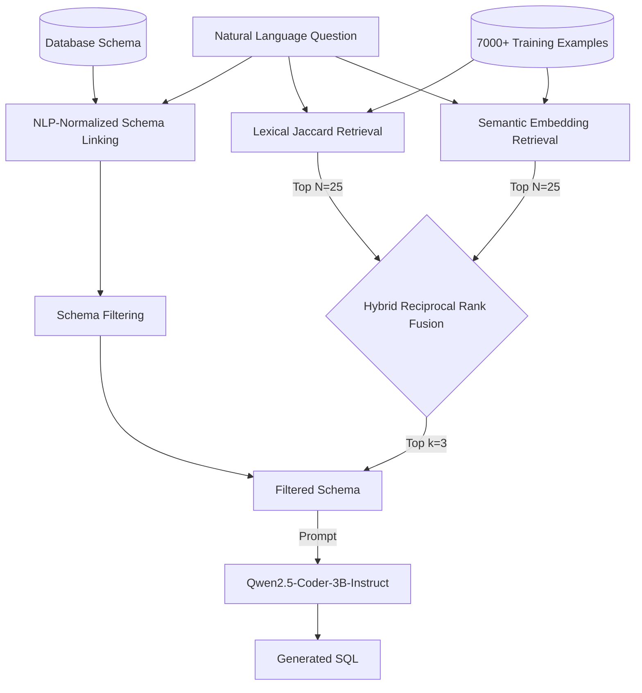

# ModelBench V1: Systematic Evaluation of Retrieval Strategies for Text-to-SQL

## Abstract

ModelBench V1 investigates how different few-shot retrieval and schema linking strategies affect the Text-to-SQL generation capabilities of a locally-hosted, small-parameter Language Model (Qwen2.5-Coder-3B-Instruct). Through a systematic series of experiments on the Spider 1.0 dataset, we demonstrated that while schema linking resolves fundamental input noise, the model's remaining logical reasoning failures are best mitigated by retrieving relevant few-shot demonstrations. We found that lexical retrieval (Jaccard) and semantic retrieval (BGE embeddings) are highly complementary, solving fundamentally different subsets of queries. By combining them using Reciprocal Rank Fusion (RRF) and bounding the candidate pool to mathematically match exhaustive search while eliminating latency, our final V1 architecture achieved a 58.03% execution accuracy, a significant improvement over the 42.50% zero-shot baseline.

## 1. Introduction

Generating SQL from natural language is notoriously difficult for small, local language models (like the 3B parameter Qwen). They frequently suffer from schema hallucination, get confused by large database schemas, and struggle to generalize logical constraints without highly relevant few-shot examples.

ModelBench exists to answer a central question: **How do different retrieval strategies affect downstream LLM task performance?** Text-to-SQL was selected as the first V1 task because its evaluation metric (Execution Accuracy against a live SQLite database) provides deterministic, objective proof of reasoning capability, eliminating the ambiguity of LLM-as-a-judge evaluations.

## 2. Research Questions

ModelBench V1 investigated the following questions:
1. How much does schema linking affect Text-to-SQL?
2. Can retrieved demonstrations improve SQL generation?
3. Does lexical retrieval or semantic retrieval provide better demonstrations?
4. Are lexical and semantic retrieval complementary?
5. Can hybrid retrieval outperform either individual strategy?
6. Can the resulting retrieval system be optimized without changing its behavior?

## 3. ModelBench Architecture

ModelBench uses a multi-stage pipeline designed to strip away irrelevant noise and provide the LLM with the most pristine, relevant context possible.



To eliminate standard RRF indexing overhead (which typically ranks the entire 7,000+ corpus), we bounded the candidate pool to just `candidate_n=25` from each retriever before applying the RRF constant.

## 4. Experimental Methodology

- **Dataset**: Spider 1.0. The 1,034-sample `dev` split was used strictly for evaluation, while the 7,000+ sample `train` split served exclusively as the retrieval corpus.
- **Model**: `Qwen/Qwen2.5-Coder-3B-Instruct`
- **Generation**: Deterministic greedy decoding (`temperature=0.0`, `do_sample=False`) to ensure reproducible variance across strategy changes.
- **Metrics**: 
  - *Execution Accuracy*: Did the generated SQL return the exact same database records as the gold SQL?
  - *Exact Match*: Did the generated SQL string match the gold SQL string exactly?
  - *SQL Validity*: Did the generated SQL execute without SQLite syntax or schema errors?
- **Leakage Prevention**: Strict unit testing prevents any `dev` samples from bleeding into the `train` retrieval index.

## 5. M4 — Schema Linking

**Motivation:** Our initial baseline revealed that injecting an entire database schema into the prompt caused rampant hallucination (25% accuracy), with the model attributing columns to the wrong tables or hallucinating joins.
**Hypothesis:** Filtering the schema to only include relevant tables based on NLP-normalized lexical overlap will improve performance.
**Methods:** We applied `nltk` WordNet lemmatization and stop-word filtering to both the question and the schema identifiers, retaining matched tables and their foreign key relationships.
**Results:** M4-B.1 achieved 42.50% Execution Accuracy (83.50% SQL Validity), resolving 99.4% of pure schema-linking failures.
**Conclusion:** Schema linking matters, but was not the dominant remaining bottleneck. The remaining 57.5% failure rate was caused by the model failing to understand complex aggregations, HAVING clauses, and nested logic, despite having the correct schema.

## 6. M5 — Lexical Few-Shot Retrieval

**Motivation:** If the model has the right schema but fails at SQL reasoning, we must anchor it with examples.
**Hypothesis:** Providing relevant Text-to-SQL demonstrations based on exact token matching will improve reasoning.
**Methods:** A deterministic Jaccard similarity retriever was used to find `k=3` examples from the training corpus.
**Results:** M5 achieved 55.13% Execution Accuracy and 27.85% Exact Match.
**Conclusion:** Few-shot retrieval substantially improves Text-to-SQL generation over the zero-shot M4 baseline (+12.6%).

## 7. M6 — Semantic Retrieval

**Motivation:** Lexical retrieval relies strictly on exact token overlap and misses semantic intent.
**Hypothesis:** Dense embeddings will retrieve examples that better match the abstract meaning of the question.
**Methods:** `BAAI/bge-small-en-v1.5` embeddings evaluated via cosine similarity (`k=3`).
**Results:** M6 achieved 55.90% Execution Accuracy and 27.47% Exact Match.
**Conclusion:** While M6 was only marginally better overall (+0.8%), an overlap analysis revealed massive complementarity. M5 uniquely solved 79 queries, while M6 uniquely solved 87. Lexical and semantic retrieval capture different signals.

## 8. M7 — Hybrid Retrieval

**Motivation:** The complementarity of M5 and M6 strongly suggests they should be combined.
**Hypothesis:** A hybrid strategy fusing both ranking signals will outperform either individual strategy.
**Methods:** We compared standard min-max score fusion against Reciprocal Rank Fusion (RRF).

| Strategy | Execution Accuracy (%) | SQL Validity (%) | Exact Match (%) |
|:---|---:|---:|---:|
| Hybrid Score (α=0.25) | 57.16 | 84.82 | 29.01 |
| Hybrid Score (α=0.50) | 55.03 | 85.30 | 28.05 |
| Hybrid Score (α=0.75) | 55.51 | 85.01 | 28.05 |
| **Hybrid RRF** | **58.03** | **85.88** | **29.50** |
| Hybrid Candidate Union | 55.80 | 84.53 | 28.43 |

**Conclusion:** RRF is more robust than direct score fusion for combining these signals. It effectively bridges the incomparable distributions of Jaccard and Cosine similarity.

## 9. Retrieval Optimization

**Motivation:** Exhaustive RRF requires indexing and scoring 7,000 candidates twice (Lexical + Semantic), creating massive CPU latency (~14s per query).
**Methods:** We bounded the candidate pool (`candidate_n`) before applying RRF.
**Results:** We evaluated `N` values of 25, 50, 100, and 200. Setting `candidate_n=25` yielded a 100% exact identity match for the final top-3 retrieved items compared to exhaustive full-corpus searching across all 1,034 samples.
**Conclusion:** `candidate_n=25` was empirically equivalent to exhaustive RRF on the evaluated Spider dev set, reducing retrieval latency to ~0.24s.

## 10. Inference Optimization

**Motivation:** Evaluating 1,034 samples sequentially took ~2 hours, preventing rapid iteration.
**Methods:** We integrated HuggingFace `generate_batch`.
**Results:** Benchmarking determined `batch_size=16` was optimal for an 8GB RTX 5060, reducing runtime by ~1.75x while remaining strictly mathematically equivalent to single-sample execution.

## 11. Final V1 System

The canonical ModelBench V1 architecture is configured as follows:
- **Model**: `Qwen/Qwen2.5-Coder-3B-Instruct`
- **Dataset**: Spider 1.0 (dev)
- **Schema Strategy**: `schema_linking_normalized`
- **Retrieval Strategy**: `hybrid_rrf`
- **RRF Constant (`c`)**: 60
- **Candidate Pool (`candidate_n`)**: 25
- **Demonstrations (`k`)**: 3
- **Batch Size**: 8 (default memory-safe baseline)
- **Decoding**: Greedy (`do_sample=False`, `temperature=0.0`)

## 12. Final Results

| Strategy | Description | SQL Validity | Exact Match | Execution Accuracy |
|:---|:---|---:|---:|---:|
| **M4-B.1** | Zero-Shot, Schema Linked | 83.50% | 12.10% | 42.50% |
| **M5** | Lexical (Jaccard) | 84.04% | 27.85% | 55.13% |
| **M6** | Semantic (BGE) | 84.04% | 27.47% | 55.90% |
| **M7 RRF** | Hybrid RRF | **85.88%** | **29.50%** | **58.03%** |

## 13. Key Findings

1. **Schema linking matters, but is not the dominant bottleneck.** Simple NLP normalization fixes >99% of schema noise. The remaining failures are logical reasoning gaps.
2. **Few-shot retrieval substantially improves Text-to-SQL generation.** Providing structural demonstrations bridges the model's logic gaps.
3. **Lexical and semantic retrieval are highly complementary.** They solve fundamentally different subsets of Text-to-SQL problems.
4. **RRF is highly robust.** It effectively fuses orthogonal retrieval strategies by sidestepping their incomparable scalar score distributions.
5. **A small bounded candidate pool can reproduce exhaustive RRF.** Bounding to `N=25` mathematically guaranteed the same top-3 items on the evaluated dataset.
6. **Engineering optimizations are critical.** Batching and cache serialization made this systematic research feasible on standard consumer hardware.

## 14. Limitations

- **Dataset Scope**: All experiments were run exclusively on Spider 1.0 (English).
- **Model Scope**: V1 evaluated a single 3B parameter model. Larger models may react differently to schema sizes and retrieval noise.
- **Candidate Pool Generality**: The `candidate_n=25` equivalence was demonstrated only on the Spider dev set. It may not universally hold for massive, million-row corpora.
- **Production Scope**: ModelBench is an offline evaluation and experimentation framework, not a production API serving system.

## 15. Future Work

V2 will explore:
- Execution-guided reflection (multi-turn generation).
- Evaluating against more complex cross-domain datasets (e.g., BIRD).
- Integrating more local LLMs.
- Expanding retrieval methodologies (e.g., structural AST matching).

## 16. Reproducibility

To reproduce the final V1 architecture and findings exactly as described, execute:

```bash
modelbench run --config configs/spider_qwen_hybrid_rrf_v1.yaml
```
